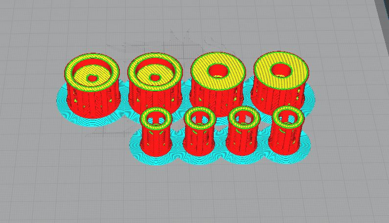
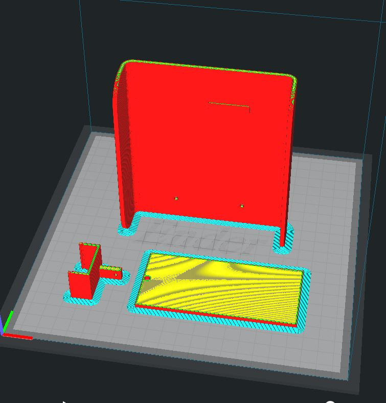
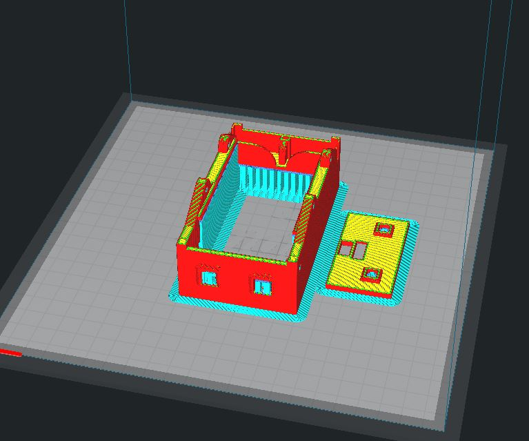
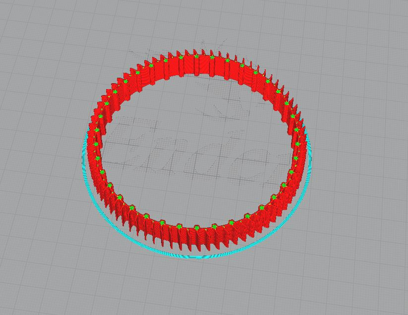
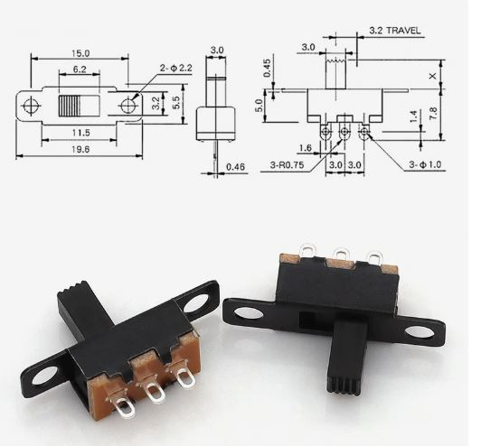
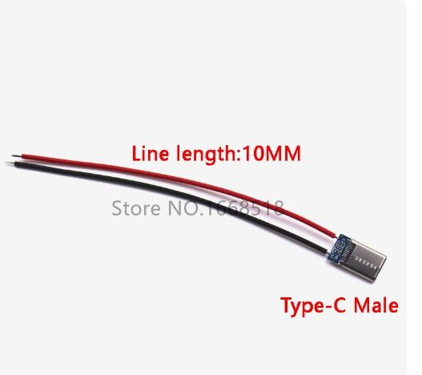
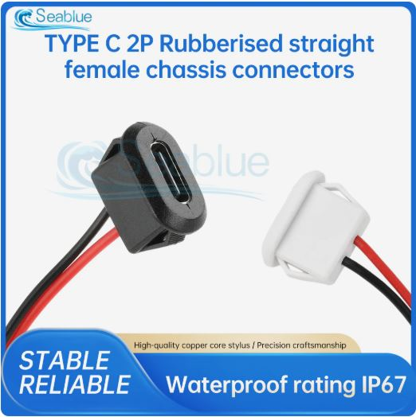

# МикРоББокс - Руководство по сборке / Assembly Guide

## 📦 Необходимые компоненты / Required Components

### Электронные компоненты / Electronics
- ESP32-CAM (AI Thinker)
- MX1508 драйвер двигателей / motor driver
- DC-DC понижающий преобразователь на 5V / buck converter to 5V (чем меньше, тем лучше / smaller is better)
- 3x адресных светодиода WS2812B на ленте / addressable LEDs on strip
- Аккумулятор крона / 9V battery (например / for example: Liitokala Li-Ion 1100 мАч)
- 2x моторы N-20 на 300rpm / N-20 motors at 300rpm
- USB Type-C гнездо / socket
- USB Type-C разъем / connector
- Выключатель / power switch
- Провод питания для кроны / battery power cable

### Механический крепеж / Mechanical Hardware
- 2x гужены M3 / M3 nuts
- 4x винта M3x8 / M3x8 screws

### Ссылки на компоненты / Component Links
- [N-20 моторы 300rpm](https://aliexpress.ru/item/1005008644116309.html)
- [Buck converter Mini-360](https://aliexpress.ru/item/1005005950433018.html)
- [Светодиодная лента WS2812B](https://aliexpress.ru/item/1005009920441973.html)

---

## 🖨️ 3D Печать / 3D Printing

### Параметры печати / Print Settings

| Параметр / Parameter | Значение / Value | Примечание / Note |
|---------------------|------------------|-------------------|
| Материал / Material | PLA | Стандарт / Standard |
| Заполнение / Infill | 20% | Оптимально / Optimal |
| Прилипание к столу / Bed Adhesion | Кайма / Brim | Для больших деталей / For large parts |
| Поддержки / Supports | Только для рамы и задней панели / Only for frame and back plate | См. ниже / See below |

### Настройки поддержки / Support Settings
⚠️ **Важно**: Отключите стенку в поддержке для легкого отделения / **Important**: Disable support walls for easy removal

### Файлы для печати / Files to Print

#### Без поддержки / Without Supports
Находятся в `3d-models/support-free/` / Located in `3d-models/support-free/`:
- `chassis_bottom.stl` - Нижняя часть шасси / Bottom chassis
- `chassis_main.stl` - Основная часть шасси / Main chassis body
- `esp32_mount.stl` - Крепление для ESP32-CAM / ESP32-CAM mount

#### С поддержками / With Supports
Находятся в `3d-models/with-support/` / Located in `3d-models/with-support/`:
- `chassis_frame.stl` - Рама шасси / Chassis frame (⚠️ требует поддержки / needs supports)
- `back_plate.stl` - Задняя панель / Back plate (⚠️ требует поддержки / needs supports)

#### Колеса / Wheels
Находятся в `3d-models/wheels/` / Located in `3d-models/wheels/`:
- `wheel_2x.stl` - Стандартные колеса (2шт) / Standard wheels (2x)
- `wheel_2x_n20.stl` - Колеса для моторов N-20 (2шт) / Wheels for N-20 motors (2x)
- `wheel_4x.stl` - Альтернативный вариант (4шт) / Alternative option (4x)

#### Гусеницы / Tracks (Опционально / Optional)
Находятся в `3d-models/tracks/` / Located in `3d-models/tracks/`:
- `track_2x_tpu95a.stl` - Гусеницы из TPU-95A (2шт) / TPU-95A tracks (2x)

**Настройки для гусениц / Track Settings:**
- Материал / Material: TPU-95A (гибкий / flexible)
- Прилипание к столу / Bed Adhesion: Юбка / Skirt
- Заполнение / Infill: 20%

### Фото колес / Wheel Photos

*Различные варианты колес для робота / Different wheel options for the robot*

---

## 🔧 Сборка электроники / Electronics Assembly

### Схема подключения / Wiring Schematic

Схемы находятся в `hardware/diagrams/`:
- `microbbox_breadboard.svg` - **Визуальная схема монтажа (рекомендуется для сборки)**
- `microbbox_schematic.svg` - Принципиальная электрическая схема
- `microbbox_pcb.svg` - Схема разводки PCB

Исходный файл Fritzing: `hardware/diagrams/fritzing/microbbox.fzz`

### Порядок подключения / Connection Order

1. **Подготовка платы / Board Preparation**
   - Разместите ESP32-CAM в креплении
   - Закрепите MX1508 драйвер
   - Установите buck converter

2. **Подключение питания / Power Connection**
   - Подключите аккумулятор к buck converter
   - Установите выключатель в цепь питания
   - Подключите USB Type-C для зарядки/программирования
   - Выход buck converter (5V) → ESP32-CAM (5V pin)

3. **Подключение моторов / Motor Connection**
   - Левый мотор → MX1508 выход A
   - Правый мотор → MX1508 выход B
   - MX1508 пины управления → ESP32-CAM GPIO 12, 13, 14, 15
   - ⚠️ **Важно**: Установите pull-down резисторы 10kΩ на пины 12-15 к GND

4. **Подключение LED / LED Connection**
   - WS2812B DATA → GPIO 2
   - WS2812B VCC → 5V
   - WS2812B GND → GND

5. **Проверка / Testing**
   - Измерьте напряжения мультиметром
   - Проверьте отсутствие коротких замыканий
   - Убедитесь в правильности полярности

Подробнее см. в [WIRING_DIAGRAM.md](WIRING_DIAGRAM.md)

---

## 🔩 Механическая сборка / Mechanical Assembly

### Фото сборки / Assembly Photos

*Шаг 1: Подготовка компонентов / Step 1: Component preparation*

*Шаг 2: Установка моторов / Step 2: Motor installation*

*Шаг 3: Монтаж электроники / Step 3: Electronics mounting*

*Шаг 4: Установка ESP32-CAM / Step 4: ESP32-CAM installation*

*Шаг 5: Подключение проводов / Step 5: Wire connections*

*Шаг 6: Финальная сборка / Step 6: Final assembly*

### Порядок сборки / Assembly Steps

1. **Установка моторов / Motor Installation**
   - Вставьте моторы N-20 в крепления шасси
   - Закрепите моторы винтами M3x8
   - Убедитесь в свободном вращении валов

2. **Установка колес или гусениц / Wheel or Track Installation**
   - Наденьте колеса на валы моторов
   - Или установите гусеницы (если используются)
   - Проверьте надежность крепления

3. **Монтаж электроники / Electronics Mounting**
   - Установите ESP32-CAM в крепление
   - Закрепите MX1508 и buck converter
   - Разместите аккумулятор в держателе

4. **Прокладка проводов / Wire Routing**
   - Аккуратно проложите провода
   - Избегайте контакта с движущимися частями
   - Используйте стяжки для фиксации

5. **Установка LED / LED Installation**
   - Приклейте светодиодную ленту (3 LED)
   - 2 LED сзади, 1 LED спереди
   - Подключите к GPIO 2

6. **Финальная сборка / Final Assembly**
   - Закрепите заднюю панель винтами
   - Проверьте доступ к USB для программирования
   - Убедитесь, что выключатель легко доступен

---

## ✅ Проверка перед первым включением / Pre-Power-On Checklist

- [ ] Все компоненты надежно закреплены
- [ ] Установлены pull-down резисторы 10kΩ на GPIO 12-15
- [ ] Проверена полярность питания
- [ ] Нет коротких замыканий (проверено мультиметром)
- [ ] Общая земля (GND) соединена
- [ ] Buck converter выдает 5V
- [ ] Провода не касаются движущихся частей
- [ ] Доступ к USB для программирования открыт

---

## 🚀 Первое включение / First Power-On

1. **Подключите питание / Power Connection**
   - Зарядите аккумулятор полностью
   - Включите выключатель
   - Проверьте, что ESP32-CAM загорелся

2. **Проверка компонентов / Component Testing**
   - Моторы не должны крутиться при включении (благодаря pull-down резисторам)
   - LED должны загореться при программировании

3. **Загрузка прошивки / Firmware Upload**
   - Подключите USB к ESP32-CAM
   - Загрузите прошивку через PlatformIO
   - См. основной [README.md](../README.md) для инструкций

4. **Тестирование / Testing**
   - Проверьте управление моторами
   - Проверьте работу LED эффектов
   - Проверьте видео с камеры
   - Проверьте WiFi подключение

---

## 🔧 Решение проблем / Troubleshooting

### Моторы крутятся при включении / Motors Spin on Power-Up
**Проблема**: Не установлены pull-down резисторы  
**Решение**: Припаяйте резисторы 10kΩ от GPIO 12-15 к GND

### ESP32 перезагружается / ESP32 Reboots
**Проблема**: Недостаточно конденсаторов развязки  
**Решение**: Добавьте конденсатор 100-470µF на входе питания

### LED не работают / LEDs Don't Work
**Проблема**: Неправильное подключение цепочки  
**Решение**: Проверьте направление DATA, VCC должен быть 5V

### Камера не инициализируется / Camera Doesn't Initialize
**Проблема**: Конфликт пинов  
**Решение**: Проверьте подключение, не используйте GPIO 2 для других целей одновременно

---

## 📚 Дополнительные ресурсы / Additional Resources

- [BOM - Список компонентов](BOM.md)
- [Схема подключения](WIRING_DIAGRAM.md)
- [Основная документация](../README.md)
- [Конфигурации](../CONFIGURATIONS.md)

---

## 📸 Галерея / Gallery

Все фото сборки находятся в папке `hardware/diagrams/assembly/`  
All assembly photos are in the `hardware/diagrams/assembly/` folder

---

**Дата обновления / Last Updated**: 2025-11-01  
**Версия / Version**: 1.0  
**Автор / Author**: МикРоББокс Team

Удачной сборки! / Happy Building! 🤖
