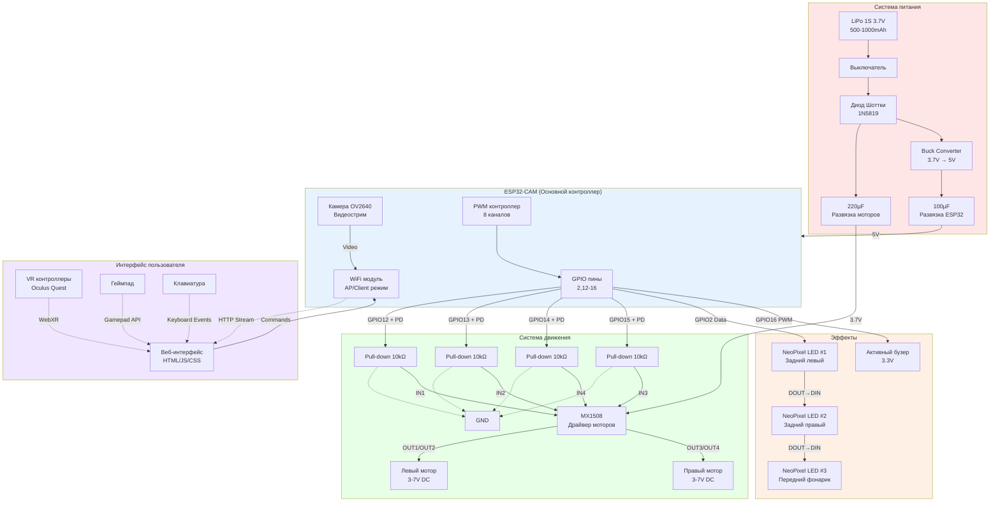
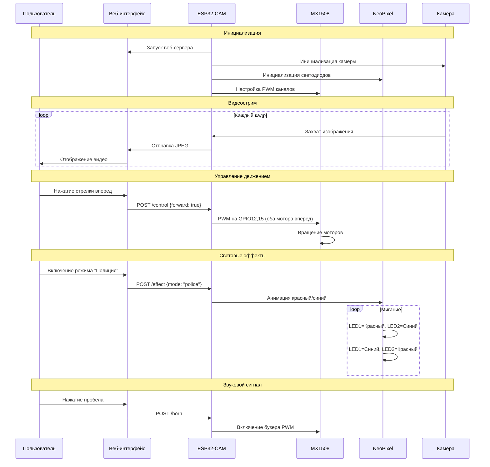
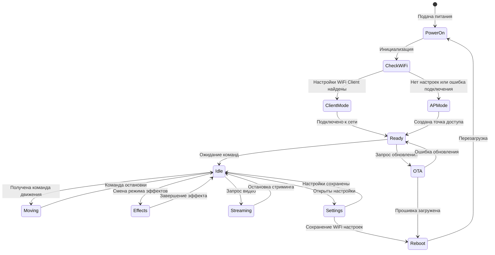
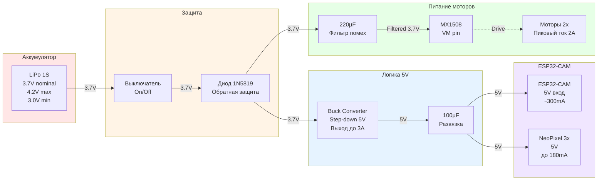
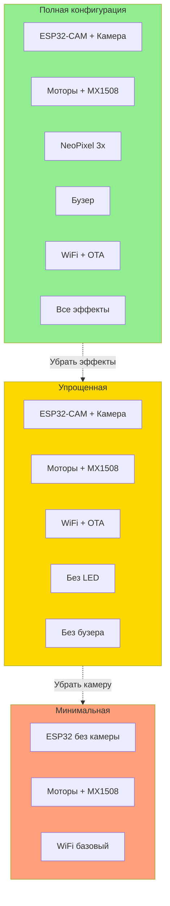

# МикРоББокс - Архитектура системы

## Блок-схема компонентов



## Поток данных управления



## Состояния системы



## Схема питания - детализация



## Конфигурации робота



---

**Дата создания**: 2025-11-01  
**Версия**: 1.0  
**Формат**: Mermaid диаграммы (рендерятся на GitHub автоматически)

## Как использовать эти диаграммы

1. **На GitHub**: Диаграммы автоматически рендерятся при просмотре этого файла
2. **Локально**: Используйте расширения для VSCode/IDE с поддержкой Mermaid
3. **Экспорт**: Скопируйте код в [Mermaid Live Editor](https://mermaid.live) для экспорта в PNG/SVG

## Редактирование

Для редактирования диаграмм:
1. Отредактируйте код внутри блоков ```mermaid
2. Проверьте синтаксис на https://mermaid.live
3. GitHub автоматически обновит отображение
